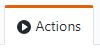
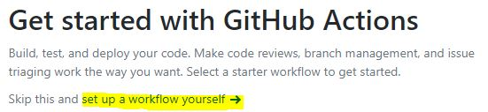

# R benchmark

This action helps you timing the run-time of your R code, and saves the timing result in your repository. 

## :bulb: Prerequisite

`Testthat` for R is required to use this action, you should have a directory, `root_dir/tests/testthat`, with testing scripts in your R project. And this action runs all testing scripts in that folder.

Note: If you are new to R testing and testthat, please check [Unit Testing for R, testthat.](https://testthat.r-lib.org/)

## :wrench: How to use


### `Set up a workflow`

1. Click  at the top your repository page.

2. Click `set up a workflow yourself` which is highlighted in this figure.  

3. Copy the [example usage](#pencil-example-usage) into the editor.

4. If you already have serveral commits in your repository. And You think it is meaningful to timing those commits, you can use [`Initalization`](#initalization) for a start.


### `Get the result`

## :pencil: Example usage
### Initalization:
```yaml
name: R-benchmark

on:
  push:
    branches: [ master ]
    paths-ignore: 
      - '.github/workflows/**'
      - 'Rperform_Data/**'
  pull_request:
    branches: [ master ]
    paths-ignore: 
      - '.github/workflows/**'
      - 'Rperform_Data/**'

jobs:
  benchmark:
    runs-on: ubuntu-latest
    steps:
    - uses: actions/checkout@v2
      with:
        fetch-depth: 0
    - name: r-benchmark
      uses: LooDaHu/R-benchmark@v1
      with:
        username: <GitHub_username>: Required
        commit: <number of commits>: Optional
```

### Normal:
```yaml
name: R-benchmark

on:
  push:
    branches: [ master ]
    paths-ignore: 
      - '.github/workflows/**'
      - 'Rperform_Data/**'
  pull_request:
    branches: [ master ]
    paths-ignore: 
      - '.github/workflows/**'
      - 'Rperform_Data/**'

jobs:
  benchmark:
    runs-on: ubuntu-latest
    steps:
    - uses: actions/checkout@v2
      with:
        fetch-depth: 0
    - name: r-benchmark
      uses: LooDaHu/R-benchmark@v1
      with:
        username: <GitHub_username>: Requried
```
